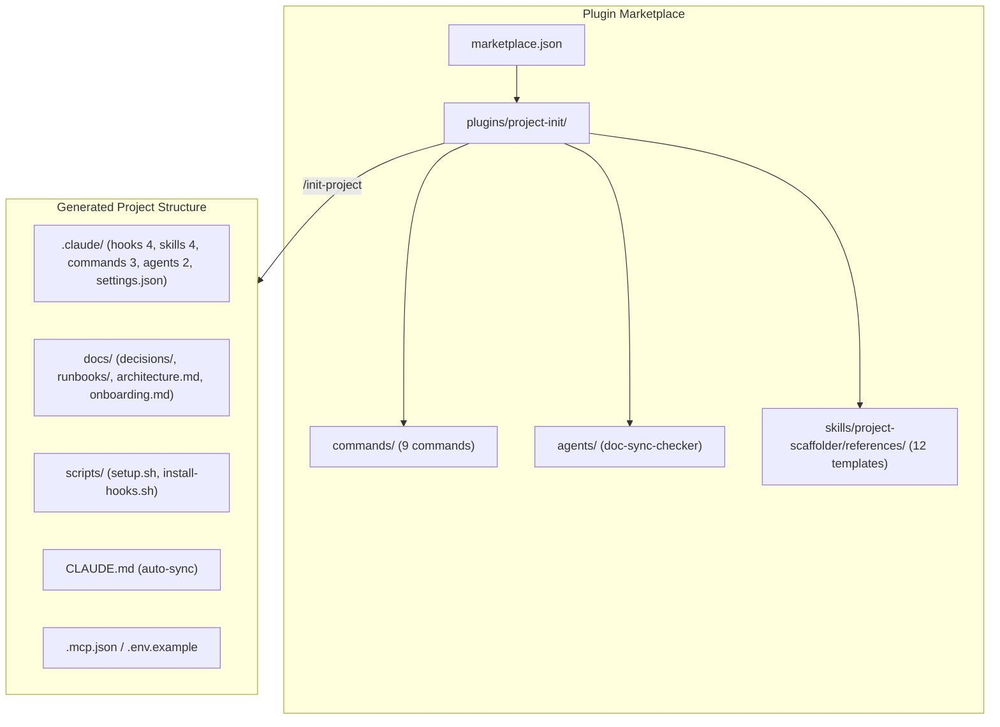
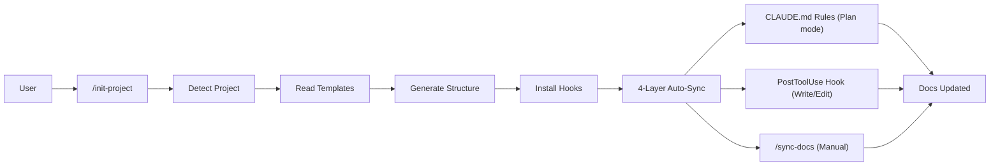

# Architecture

---

# English

## System Overview

project-init is a Claude Code plugin that provides project structure initialization and automated documentation synchronization.
It is distributed as a marketplace repository containing a single plugin (`project-init`).
When users run `/init-project`, it detects the existing project and generates a tailored structure.

## Components

### Plugin Layer
- **plugins/project-init/commands/** -- 9 slash commands (init-project, sync-docs, generate-readme, generate-changelog, add-adr, add-module, add-runbook, add-reference-doc, health-check). Each `.md` file defines one command.
- **plugins/project-init/agents/** -- doc-sync-checker agent. Analyzes documentation sync status in parallel.
- **plugins/project-init/skills/** -- project-scaffolder skill. Contains 12 reference template files in `references/` (includes shared writing-style-guide).

### Generated Project Layer
- **.claude/hooks/** -- PostToolUse (doc sync detection), PreToolUse (secret scanning), SessionStart (context loading), Notification (webhook).
- **.claude/skills/** -- code-review (confidence-based filtering), refactor, release, sync-docs skills.
- **.claude/commands/** -- review, test-all, deploy commands.
- **.claude/agents/** -- code-reviewer (green), security-auditor (red) agents.

### Documentation Layer
- **docs/architecture.md** -- Bilingual architecture document (this file).
- **docs/decisions/** -- Architecture Decision Records (ADRs).
- **docs/runbooks/** -- Operational runbooks.
- **docs/onboarding.md** -- Developer onboarding guide.

### Distribution Layer
- **.claude-plugin/marketplace.json** -- Marketplace manifest.
- **plugins/project-init/.claude-plugin/plugin.json** -- Plugin manifest.

## Full Architecture Diagram

## Data Flow Summary

## Key Design Decisions

- **Marketplace structure** -- Plugins organized under `plugins/` subdirectory to support multiple plugins from a single repository.
- **Markdown-based definitions** -- All commands/skills/agents defined as Markdown for easy version control and code review.
- **4-layer auto-sync** -- Plan mode rules, PostToolUse hooks, /sync-docs command, and commit-msg hook ensure documentation stays current.
- **Confidence-based code review** -- Only reports issues scoring 75+ to filter false positives and reduce review fatigue.
- **Bilingual support** -- All user-facing documents (README, CHANGELOG, architecture, ADR, runbook) provided in Korean/English. Shared writing-style-guide ensures consistency.
- **Mermaid architecture diagrams** -- All architecture flows use Mermaid flowchart instead of ASCII box diagrams: GitHub renders them natively and doc-sync regeneration stays reliable (ADR-007).

## Operations
- Release: see [docs/runbooks/release.md](runbooks/release.md) for the maintainer-side version bump and tag procedure
- Update or remove the plugin: see [docs/runbooks/update-from-marketplace.md](runbooks/update-from-marketplace.md) for the consumer-side procedure
- Architecture decisions: see [docs/decisions/](decisions/) -- ADR-001 (bilingual policy), ADR-002 (HTML anchor navigation), ADR-003 (shared writing-style-guide), ADR-004 (hook non-blocking failure), ADR-005 (implementation reference docs), ADR-006 (hybrid detection + confirmation), ADR-007 (Mermaid architecture diagrams)

---

# 한국어

## System Overview

project-init은 Claude Code 플러그인으로, 프로젝트 구조 초기화와 문서 자동 동기화를 제공합니다.
마켓플레이스 저장소로 배포되며, 단일 플러그인(`project-init`)을 포함합니다.
사용자가 `/init-project`을 실행하면 감지된 프로젝트에 맞춤 구조를 생성합니다.

## Components

### Plugin Layer
- **plugins/project-init/commands/** -- 9개의 슬래시 커맨드 (init-project, sync-docs, generate-readme, generate-changelog, add-adr, add-module, add-runbook, add-reference-doc, health-check). 각 `.md` 파일이 하나의 커맨드를 정의.
- **plugins/project-init/agents/** -- doc-sync-checker 에이전트. 문서 동기화 상태를 병렬로 분석.
- **plugins/project-init/skills/** -- project-scaffolder 스킬. `references/` 디렉토리에 12개의 템플릿 파일 포함 (공통 writing-style-guide 포함).

### Generated Project Layer
- **.claude/hooks/** -- PostToolUse(문서 동기화 감지), PreToolUse(시크릿 스캔), SessionStart(컨텍스트 로드), Notification(웹훅).
- **.claude/skills/** -- code-review(신뢰도 기반 필터링), refactor, release, sync-docs 스킬.
- **.claude/commands/** -- review, test-all, deploy 커맨드.
- **.claude/agents/** -- code-reviewer(green), security-auditor(red) 에이전트.

### Documentation Layer
- **docs/architecture.md** -- 이중언어 아키텍처 문서 (이 파일).
- **docs/decisions/** -- ADR(Architecture Decision Records).
- **docs/runbooks/** -- 운영 런북.
- **docs/onboarding.md** -- 개발자 온보딩 가이드.

### Distribution Layer
- **.claude-plugin/marketplace.json** -- 마켓플레이스 매니페스트.
- **plugins/project-init/.claude-plugin/plugin.json** -- 플러그인 매니페스트.

## Full Architecture Diagram

## Data Flow Summary

## Key Design Decisions

- **마켓플레이스 구조** -- 플러그인을 `plugins/` 하위 디렉토리로 구성하여 단일 저장소에서 여러 플러그인을 관리할 수 있도록 확장성 확보.
- **Markdown 기반 정의** -- 모든 커맨드/스킬/에이전트를 Markdown으로 정의하여 버전 관리와 코드 리뷰가 용이하도록 함.
- **4계층 자동 동기화** -- Plan mode 규칙, PostToolUse 훅, /sync-docs 커맨드, commit-msg 훅의 4단계로 문서 동기화를 보장.
- **신뢰도 기반 코드 리뷰** -- 75점 이상의 이슈만 보고하여 거짓 양성을 필터링하고 리뷰 피로 감소.
- **이중언어 지원** -- 모든 사용자 대면 문서(README, CHANGELOG, architecture, ADR, runbook)를 한국어/영어 병기로 제공. 공통 writing-style-guide로 일관성 유지.
- **Mermaid 아키텍처 다이어그램** -- 모든 아키텍처 흐름은 ASCII 박스 다이어그램 대신 Mermaid flowchart를 사용: GitHub이 네이티브로 렌더링하며 문서 동기화 재생성이 안정적으로 유지됨 (ADR-007).

## Operations
- 릴리스: 메인테이너 측 버전 갱신과 태그 절차는 [docs/runbooks/release.md](runbooks/release.md) 참조
- 플러그인 업데이트 또는 제거: 소비자 측 절차는 [docs/runbooks/update-from-marketplace.md](runbooks/update-from-marketplace.md) 참조
- 아키텍처 결정: [docs/decisions/](decisions/) 참조 -- ADR-001(이중언어 정책), ADR-002(HTML 앵커 내비게이션), ADR-003(공유 writing-style-guide), ADR-004(훅 비차단 실패), ADR-005(구현 참조 문서), ADR-006(하이브리드 감지 + 확인), ADR-007(Mermaid 아키텍처 다이어그램)
